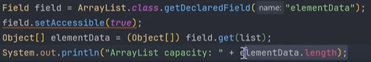

**Collection Framework**
* The Collection interface in Java is a core member of the Java Collections Framework located in the java.util package. It is one of the root interfaces of the Java Collection Hierarchy. The Collection interface is not directly implemented by any class. Instead, it is implemented indirectly through its sub-interfaces like List, Queue, and Set.
* List: A List is an ordered collection that allows duplicates. It is an interface that allows the storage of elements in a specific order, and elements can be accessed by their index.
* Set: A Set is a collection that does not allow duplicate elements. It models the mathematical set abstraction and ensures that no two elements in the set are equal.
* Queue: A Queue represents a collection designed for holding elements prior to processing. It is used to model a FIFO (First-In-First-Out) ordering, where elements are added to the tail and removed from the head.
* Deque (Double-ended Queue): A Deque allows insertion and removal of elements from both ends. It is a specialized type of Queue.
* Map: A Map is an object that maps keys to values, where each key is unique, and the map allows retrieval of values based on their keys.
*******
**ArrayList**
*  It provides a dynamic array, meaning the array grows and shrinks as elements are added or removed.
*  Dynamic resizing is achieved by creating new array when current array is full and copying the elements to new array.
*  Initial Capacity (refers to size of array that can hold elements before resizing needed) : when you create array initial capacity is 10.

What is ArrayList?
 - Resizable Array implementation of List interface, Dynamically changes size

Array Methods:
    add(element): add elements to the end of the list
    addAll(Collection)
    get(index)
    size()
    contains(element): checking for element
    remove(index i): removes by index
    remove(Object o): removes by value
    add(index, element): add at specific index and shift all next elements
    set(index, element): update element at index
```java
    List<Integer> list = new ArrayList<>();
    list.add(1);
    list.add(2);
    list.add(3);
    
    list.remove(1); //removes based on index
    //result : [1,3]

    list.remove(Integer.valueOf(1)); //removes based on value
    //result : [2,3]
```

can directly print list as it uses toString mehtod; inherits to string method from ArrayList <- AbstractList <-  AbstractCollection::toString

Arraylist Intenal working:

    Unlike regular array of fixed size it can grow and shrink as elements added and removed, achived by creating new array when current array is full and copying the elements to new Array.
    internally ArrayList is implemented as array of object references.
    When created initially capacity of ArrayList is 10; capacity: Intenal array that can hold elements before needing resize.

Adding Elements:
* Check Capacity: checks if enough space available.
* Resize if Necessary: if full, create new ArrayList with larger capacity(1.5X of current) and copy elements.
* Add the element: new element is added at proper index and size is increased.

Resizing the Array:
* Initial Capacity: default capacity 10.
* Growth Factor: When internal array is full, new array is created with size 1.5X the old array. it balances memory efficiency and resizing cost.
* Copying elements: After resizing elements of old array copied to new Array, Which is O(n) operation

Removing Elements:
* Checks Bounds: Checks if index is within valid range.
* Remove the Element: removed, and all elemets to right of removed elements are shifted one position to the left to fill gap.
* reduce size: decremented by 1.
  * Does not shrink automatically need to do manually
  * Checking capacity using reflection API:  
  * Reducing Size: list.trimToSize()
    
Methods Creating List:
    
* Resizeble and Modifible List:
```java
    List<String> list = new Arraylist<>();
    list.add("G-Wagon");//SUCCESS
    list.set(1, "Supra"); //SUCCESS
```
* Modifible but Fixed-sized:
```java
    List<String> list = Arrays.asList("Supra", "Mustang", "GTR");
    list.add("G-Wagon");//ERROR
    list.set(1, "G-Wagon"); //SUCCESS
```

* Unmodifiable List:
```java
    List<String> list =  List.of("Supra", "Mustang", "GTR");
    list.add("G-Wagon");//ERROR
    list.set(1, "G-Wagon"); //ERROR
```

Converting To Array:
```java
    List<String> list = Arrays.asList("Supra", "Mustang", "GTR");
    Object[] objArray = list.toArray(); // Default returns Objects array
    String[] array = list.toArray(new String[0]);// Specify type with 0 size array for specific type of array
```
Time Complexity in ArrayList:
* Access by index(get) is O(1).
* Adding Element is O(n) in worst case when resizing occures.
* Removing Elements O(n) as it involves shifting of elements.
* iteration O(n).


Sorting Array List:

Natural order of sorting is 
```java
    Collections.sort(list); //Using collections interface
    list.sort(null); //using sort of ArrayList
```

Comparator:
* Used to sort collection with custom logic.
* It is function interface with one abstract method compare(Object o1, Object o2);
* Used to compare two same type of objects to determine their ordering.
* Can use by creating Implementation class of with lambda expression.
* Using impl class

```java
    import java.util.Comparator;


    class objectComparator implements Comparator<String>{
    @Override
        public  int compare(String s1, String s2){
            return s1.length() - s2.length();
        }
    }
    
    //Same using lambda expression
    carList.sort((car1, car2)-> car1.name.length()-car2.name.length());
    
```

Comparator methods:

* Comparator.comparing(Function): takes method ref as parameter.
    - generally the parameter is getter method of field which we want to compare. 
* Comparator.reversed(): revers the list.
* Comparator.thenComparing(Function): used for chaining comparators.