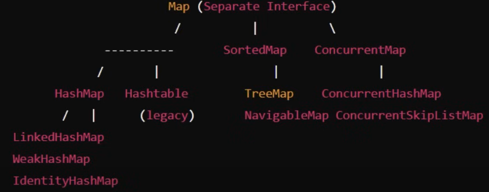

**Map:**



* Map: is an object that maps keys to values. cannot contain duplicate key and each key maps to one value.

**Map does not extend the Collection Interface.**


* Characteristics: 
* Key-value pairs:
* Unique Key: 
* One key per value:
* oder: some implementations maintains order.
  * LinkedHashMap -> Insertion order
  * TreeMap -> Natural order
  * HashMap -> No ordering

  
<H2>HashMap</H2>

<h3>Methods:</h3>
* map.put(key, value);
* map.get(key);
* map.containsKey(key);
* map.containsValue(value);
* map.remove(key, value);: removes if similar entry found. 
* map.putIfAbsent(key, value);
* map.getOrDefault(key, defaultValueIfKeyNotPresent);


* Iterating Map:
````java
    //using key set
    Set<Integer> keys = map.keySet();
    for(int i: keys){
        System.out.println(map.get(i));
    }
    
    //using entry set
    Set<Map.Entry<Integer, String>> entries = map.entrySet();
    for(Map.Entry<Integer, String> entry: entries){
        System.out.println(entry.getKey()+" "+entry.getValue());
    }

    //updating values
    for(Map.Entry<Integer, String> entry: entries){
        entry.setValue(entry.getValue().toUpperCase());
    }
````


<h2>HashMap Characteristics:</h2>
* Unordered: does not maintain order.
* Allows null keys and values: one null key and multiple null values allowed.
* Not Synchronized: requires external synchronization.
* Performance: offers constant performance (O(1)) for basic operations like get and put, assuming the hash function disperses elements properly.
* Load Factor and capacity:
  - Load factor determines when to resize the array.
  - Default load factor is 0.75; HashMap will resize when 75% of it's capacity filled.
  - Initial capacity is 16; after adding 12 elements it will resize.
  - Default growth factor is 2;  meaning that the capacity of the underlying array is doubled whenever the HashMap is resized.

<h2>Internal Structure of HashMap:</h2>
<h4>1.Hashing the Key:</h4>
* First, Key passed through hash function to generate unique hash code(an integer number).
* This hash code determines where the key-value pair will be sored in internal array.
* 
<h4>2.Calculating Index:</h4>
* Hash code used to calculate an index in the array(bucket location) using
  - int index= hashcode % arraySize;
* Index decides which bucket will hold key value pair
  - if size is 16; hashcode will be divided by 16, and the reminder will be the index

<h4>3.String in Bucket:</h4>
* The key value pair is stored in the bucket at calculated index.
* Each bucket can hold multiple key-value pairs (called collision handling).

<h4>4.Handling Collision:</h4>
* Since different keys can generate same hash value and hence same index, Hashmap uses technique to handle this situation.
* Hashmap uses LinkedList(or balanced tree after java 8).
* If multiple key value pairs maps to same bucket, they are stored ina a linked list inside the bucket.
* In java 8 this linked list is converted to balanced binary tree after list size reaches particular threshold i.e 8; 
* While retrieving Hash map travers linked list checking each key.

<h4>5.Retrieving Data:</h4>
* Hashing the key: on get(key); key is hashed using same hashing function to calculate hash.
* Finding the index: Hashcode is used to find index of bucket where key-value pair is stored.
* Searching in bucket: Once correct bucket is found it check for the key in that bucket, if it finds the key, it returns associated value.
* Structure of the Node of LinkedList used in collision:
```java
  static class Node<K, V> {
  final int hash;   // Hash code of the key
  final K key;      // Key
  V value;          // Value associated with the key
  Node<K, V> next;  // Reference to the next node (for collision chain)

  Node(int hash, K key, V value, Node<K, V> next) {
    this.hash = hash;
    this.key = key;
    this.value = value;
    this.next = next;
  }
}
```

<h2>HashMap Resizing (Rehashing):</h2>
* Hashmap has a internal array size, which is default 16.
* when the number if elements grows and exceed certain load factor (default 0.75), HashMap automatically resizes array to hold more data and avoid collision.
* This process is called rehashing.
* The default size is 16, so when more than 12 elements(16 * 0.75) inserted, HashMap will resize.
* <h4>During Rehashing:</h4>
1. Array size is doubled.
2. All existing entries are rehashed(i.e. their positions are recalculated as in formula (index = hashcode%size) size is changed) and placed into the new Array.
3. This ensures the hashmap continues to perform efficiently even if the more data is added.

<h2>Time Complexity:</h2>
* get() and put() : O(1) -- assuming no collision
* If more collisions and more entries are stored in same bucket: O(n)
* Java 8, If there are too many elements in bucket : O(log n) --linkedList converted to balanced tree.

<h2>When using User-Defined Objects in Map :</h2>
* **Make sure you override hascode() and equals() methods of object class.**
* Refer [Main.java](src%2Fmain%2Fjava%2Forg%2Fjavaeight%2FmapPrac%2FMain.java)