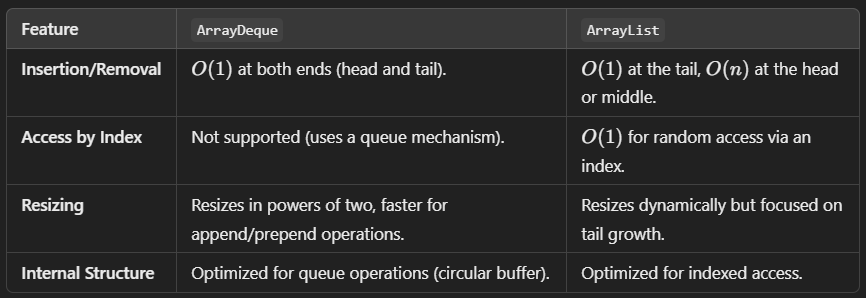

<h2>Queue:</h2>
* Based in FIFO principle.
* Elements added at the end and removed from the front.
* Can implement using LinkedList:
  * enqueue ->  list.addLast(element): to add element at end.
    * add() : throw exception when added in full queue.
    * offer() : just returns false.
  * dequeue ->  list.removeFirst(): to remove element for other end i.e. front.
    * remove() : throws exception when called on empty queue. 
    * poll() : returns null when called on empty queue.
  * peek ->
    * element() : throws exception when called on empty queue.
    * peek() : 


<h3>PriorityQueue:</h3>
* Part of Queue Interface.
* Orders (not sort) elements based on their natural ordering.
* Custom comparator for customized ordering.
* Can pass comparator to constructor.
* does not allows null elements.
* **Ordering refers to which element will remain on TOP to be removed, and does not consider another elements ordering.**
* Refer: [PriorityQueueDemo.java](src%2Fmain%2Fjava%2Forg%2Fjavaeight%2FqueuePrac%2FPriorityQueueDemo.java)


* **Internal:**
* Priority queue is implemented as a min-heap by default (for natural ordering).
* Min heap is a binary tree which always balances itself to keep the smallest element on its root(top).
* keeping O(log n) time complexity for insertion, retrieval and deletion.

<h3>Deque(Double Ended Queue):</h3>
* <b>ArrayDeque</b> : ArrayDeque (short for "Array Double-Ended Queue") is a resizable array-based implementation of the Deque interface.
* introduced in Java 6 as part of the java.util package. 
* It supports operations at both ends of the deque, making it a versatile and efficient data structure for stack and queue-like behavior.


* ArrayDeque is a versatile, high-performance data structure that excels in scenarios requiring frequent insertions and deletions at both ends. 
* Its circular buffer design and efficient resizing make it faster than ArrayList for queue and stack operations. 
* However, it is not suited for random access or scenarios requiring thread safety without external synchronization.


* <b>LinkedList as Queue:</b> LinkedList is a highly suitable data structure for implementing a queue in Java due to its efficient operations for adding and removing elements from both ends.
* It provides an optimal choice when working with queue-based operations like FIFO (First In, First Out) processing.
* Efficient Memory Usage: Since LinkedList stores elements in nodes with references to the next and previous elements, it dynamically resizes and avoids wasting memory, unlike an array-backed implementation (like ArrayList).
* Queue-Specific Methods: LinkedList implements the Queue interface, which provides methods such as offer(), poll(), and peek() that are specifically designed for queue operations.


<h3>Blocking Queue:</h3>
* Thread Safe queue Interface.
* Waits for queue to become non-empty when retrieving something.
* Or waits for space to add something to the list.
* Simplifies concurrency problems like producer-consumer.
* Methods:
  * put: Blocks if the queue id full until space becomes available.
  * take: Blocks if the queue is empty until an element becomes available.
  * offer: waits for space, can specify waiting time.

<h4>Implementations:<h/4>


<b>ArrayBlockingQueue: </b>
* A bounded blocking queue backed by an array.
* Fixed size determined at the time of initialization.
* Uses single lock for both enqueue and dequeue operations.
* Useful in less threaded environment
```java
    BlockingQueue<Integer> queue = new ArrayBlockingQueue<>(5);
```
<b>LinkedBlockingQueue: </b>
* Can be bounded or unbounded. backed by LinkedList.
* Put will not block queue if queue is unbounded.
* Allows a higher degree of concurrency because it uses separate locks for producers and consumers.
* Uses two separate locks for enqueue and deque operations.
* Useful in More threaded environment

<b>PriorityBlockingQueue: </b>
* An unbounded queue that orders elements based on their natural ordering or a specified comparator.
* Binary heap as array and can grow dynamically
* Does not use fairness or separate producer/consumer locks.

<b>SynchronousQueue: </b>
* Has no storage capacity.
* Each insertion must wait for a corresponding removal (and vice versa).
* Cannot store elements.
* Capacity of at most 1 element.

<b>DelayQueue: </b>
* Thread safe Unbounded.
* Stores elements that implement the Delayed interface.
* Elements can only be retrieved when their delay has expired.
* Internally PriorityQueue is used.


<h4>ConcurrentLinkedQueue:</h4>
* Implementation of queue interface that supports lock-free thread safe operations. 
* Uses compare and Swap method internally.

<h4>ConcurrentLinkedDequeue:</h4>