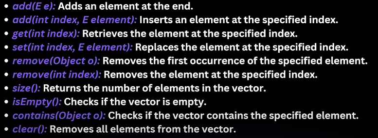

**Vector:**
* part of java.util package, one of the legacy class that implements List interface.
* Introduced in java 1.5; it is synchronized making it thread safe.
* Due to synchronization overhead, generally recommended to use ArrayList or alternatives in single threaded environment.
* Despite Vector is still useful in multithreaded env where thread safety is Concern.

**Features of Vector:**
* Dynamic Array: Like ArrayList, Vector can grow dynamically as elements are added to Vector. 
* Synchronized: All methods Synchronized.
* Legacy Class: part of original java release, and considered as legacy class.
* Resizing Mechanism: when capacity exceed, it doubles it's size.
* Random Access: Similar to ArrayList, Allows Random access of elements.

**Constructors of Vectors:**
* Vector(): creates vector with initial capacity 10.
* Vector(Integer linitialCapacity): creates vector with specified initial capacity.
* Vector(Integer linitialCapacity, Integer capacityIncrement): creates vector with specified initial capacity and Capacity increment.
* Vector(Collection<? extends E> c): Creates vector containing elements of specified collections.

**Methods of Vector:**
    

**Internal Implementation of Vector:**
* Internally uses array to store elements.
* The size of array grows as elements added.
* The default behavior is to double the size when it runs out of space.
* Resizing operation is costly; it requires copying elements to new, larger Array.
    

**Synchronization and Performance:**
* Since All methods are synchronized it provides thread safety, but introduces performance overhead in single threaded environment, AS Synchronization adds locking and unlocking cost.
* ArrayList is generally preferred over vector when synchronization is required, for thread safe collections, the CopyOnWriteArrayList or ConcurrentHashMap from java.util.concurrent package is often recommended instead.

```java
    import java.util.Vector;

    Vector<Integer> vector = new Vector<>();
    vector.add(1);
    vector.add(2);
    for(int i = 0; i<vector.size(); i++)
        System.out.println(vector.get(i)); //1,2
    
    vector.capacity();  //10
```